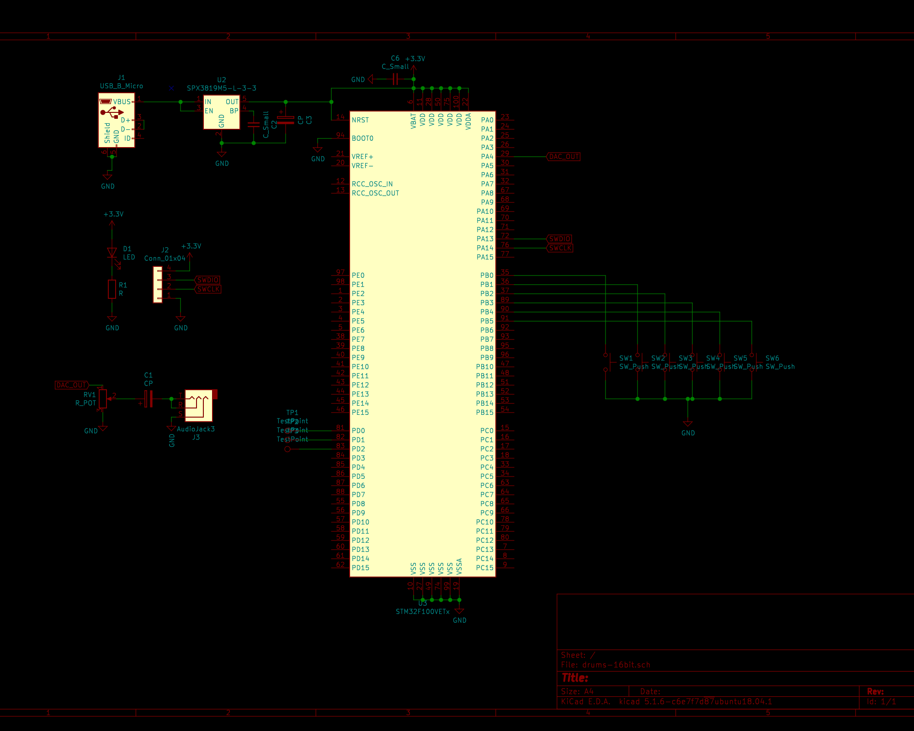

# Portable electronic drums

## Why
I created this electronic "drum kit" for fun, thinking of a portable toy where you can smash buttons to play drums.
I don't know how to play drums and this showed in the final results.

What I tried to achieve:

* multiple drum sounds
* natural and clear drum sound (not synthesized)
* natural sound playing (explained below)
* portability

What I managed to achieve:

* 6 different drums sounds: kick, snare, tom 1, tom 2, crash, ride
* pretty fine sound (far from perfect) by using drum samples at 22KHz and 12 bit resolution
* natural sound playing (explained below)
* power from micro-USB connector(external battery or PC)
* audio jack output for connecting to headphones or audio amplifier
* volume control knob

This project **is not**:

* a MIDI controller
* a drum machine
* a drum sound synthesizer

What I mean by **natural sound playing**. There are toys/devices with inputs that trigger sound playing. When you push a button, a sound will play, but immediately pushing another button will stop the currently playing sound and start playing the new one. This is not how nature/physics works. When you hit multiple drums one after the other, the sounds from multiple drums will mix. Same for any other instruments. It's this natural behavior that I tried to incorporate into this project.

## Working principle and MCU choice
The star of the show is the **STM32F100VET6B** MCU.

There are 6 push buttons, one for each drum sound.
When you press a button, a drum sound is played by the MCU using its 12bit DAC.
Press multiple buttons in short time and the MCU will mix the sounds and play them into the DAC.

Each of the 6 drum sounds is sampled at 22050 Hz sample rate with 16 bits resolution.
The duration of each sample is less than 2s.
Some napkin math for how much flash memory we need to store the 6 sounds would be:

```
sounds * sample_rate * resolution_bytes * average_sound_duration_seconds = 
6 * 22050 * 2 * 1.5 = ~387 KB
```

We also need to store the program besides the drum sounds and this is why I chose a 512KB flash MCU.

I chose this MCU for this project, specifically for its 512KB flash size and because it incorporates a DAC.

The sound that is outputted by the DAC is connected to an audio jack through a potentiometer that adjusts the amplitude of the output signal.

## The drum sounds
The drum sounds were downloaded from the Internet as mp3 files.

These sounds were converted from mp3 to raw audio data using Audacity.

My first attempt was to use 8 bit resolution audio samples and fit everything into a MCU with smaller flash memory.

The problem of **8 bit audio** is that even though it's good enough to hear most of the details, it's always accompanied by a high frequency hiss.

This high frequency hiss is known as *quantization noise* and it's very unpleasant. The smaller the resoultion of your signal the more "square-ish" it looks. And square waves have many high frequency harmonics.
More on this subject on wiki [here](https://en.wikipedia.org/wiki/Quantization_(signal_processing)#Quantization_noise_model)

The solution to get rid(of most) of this high frequency hiss was to use a better resolution for the audio. Thus I decided to export the audio waves as **16 bit integers**. Given that the MCU's DAC has only **12 bits** of resolution, we can't use the full range of 16 bit audio, but 12 bits is way better than using 8 bits.

The audio samples need to be used as **signed integers**. This is needed in order to have a natural behavior when mixing the samples. For example, mixing two sine waves of the same frequency but with 180 degree phase shift would result in complete silence. This will not happen if the the sound samples are used as unsgined integers. If you don't plan to mix audio, then using unsigned integeres is completely fine for sound reproduction.

For converting the audio samples from raw data exported by Audacity to C arrays, I used the great **xxd** tool, some hardcoded dirty **awk** and some very small manual edit.
Unfortunatelly I didn't save the exact line, but I'm pretty sure it looked like this:

```xxd -e -g 2 crash-16bit-sign.raw | awk '{print "0x"$2", ""0x"$3", ""0x"$4", ""0x"$5", ""0x"$6", ""0x"$7", ""0x"$8", ""0x"$9","}'```

## Software
The software uses TMR2 to tick at 22050 Hz. It also confgures the DAC to output the value from the register at each TMR2 tick.
An infinite loop does the work and then waits for the TMR2 to expire. The work at each iteration means:

* check which button was pressed, and mark corresponding sound as playing
* keep a list of sounds to play
* keep a counter for how many samples played of each sound
* take the current sample of each of the sounds to play and mix them
* decrement the samples played counter
* mark sound as not playing if counter reached 0
* put the mixed value in the DAC register
* wait for TMR2 to tick again and restart work

## Hardware
I created a custom PCB for this project. I wanted to experiment with Kicad since I only used Eagle before. As a I side note, I'm very satisfied by Kicad's features and openness.

The PCB is very simple:

* a microUSB connector for supplying power
* a LDO regulator for turning 5V from microUSB to 3.3V necessary for MCU
* a red LED
* 6 buttons for drum sounds
* STM32F100VET6B MCU
* a potentiometer for adjusting sound volume
* an audio jack to connect headphones or amplifier

The design also contained an op-amp to buffer the signal from the DAC but I had some issues with it. I observed that it's not really needed after all. Audio signal from DAC is powerfull enough to drive headphones. The MCU advertises that its DAC has buffered outputs and I also enabled that in software.




## Conclusion
This is a fun toy, but it's nowhere going to be the same thing as playing even the most basic drum kit.

As I said in the beginning, I never played real drums and I didn't knew that 6 buttons can't really replace the most basic 3 pieces drum kit.

That's because even though you have 3 pieces, there are many ways to hit them, creating different sounds: hit the drum, hit the rim, closed cymbals, open cymbals, cymbal pedals and probably many others.
Also, on real drums you will hit the same drum with two sticks very quickly. And this you can't really do with two fingers on a push button.

The PCB components layout lacks in terms of ergonomics, looks and it has an extra unused op-amp footprint that needs to be bypassed with a wire strap.
But I don't want to spin another PCB since the purpose of the project was achieved and probably not many people would find it interesting to reproduce it.

Most importantly is that I learned some new stuff doing this project and it can be used for some limited fun.

 

## Video here

This is me awfully playing with one hand. With the other hand I was holding the recording camera.

https://user-images.githubusercontent.com/4208556/143319866-a4ecc4ed-9de9-49c2-8885-e092aff31822.mp4